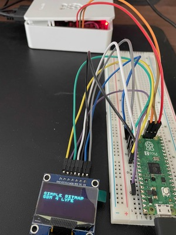

# SBM (Simple BitMap) <WIP>

## Table of Content
[Overview](#overview)<br>
[Objective](#objective)<br>
[Setup](#setup)<br>
[Executing](#installing)<br>
[Resources](#resources)<br>

## Overview

I am creating a portable C library that will be used to link with other pico_sdk based projects to bring functionality to interact with a SH1106 OLED.<br>

## Objective

- [ ] Create portable library containing basic SH1106 OLED functionality.<br>

## Setup

Here's how I setup the GPIO Ports on the Pico2<br>

- Pin configurations can be modified in the SH1106_Interactions.h via macro definitions. However, the library will have to be rebuilt and reinstalled again.<br>

On SH1106 Connection:<br>
GND -> GND(pin 28)<br>
VCC -> 3V3(OUT, pin 36)<br>
CLK -> GP18(pin24)<br>
MOSI -> GP19(pin25)<br>
RES -> GP20(pin26)<br>
DC -> GP16(pin21)<br>
CS -> GP17(pin22)<br>

<br>

## Installing
```
$ mkdir build && cd build && cmake ..
$ make install
```

## Uninstalling
- Executing "make install" will generate an install_manifest.txt
- For now, just remove the files that were generated until I create a fancier way to do this
```
$ sudo rm -rf /usr/local/include/sbm
$ sudo rm /usr/local/lib/libsbm.a
```

## Resources

[SH1106 Adafruit Product Spec](https://cdn-shop.adafruit.com/product-files/5228/5223-ds.pdf)<br>
[Adafruit SH1106 Examples](https://github.com/adafruit/Adafruit_SH110x/blob/master/)<br>
[Micro Center OLED](https://www.microcenter.com/product/643965/inland-iic-spi-13-128x64-oled-v20-graphic-display-module-for-arduino-uno-r3)<br>
[Sino Wealth SH1106 PDF](https://www.pololu.com/file/0J1813/SH1106.pdf)<br>
